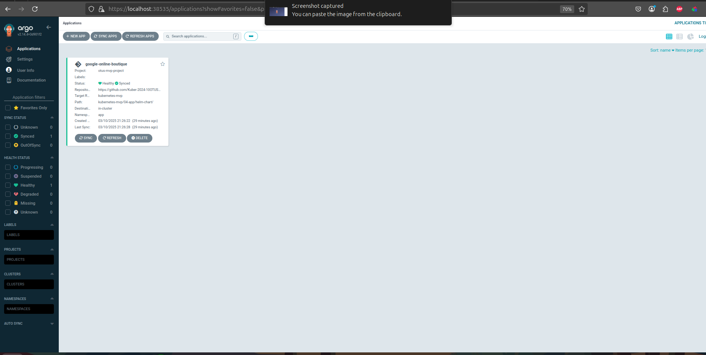

MVP

Необходимые пререквизиты для развертывания managed-kubernetes yandex-cloud:
1) доступ к самому облаку:  

```
# yc config list  
token: ***  
cloud-id: ***  
folder-id: *** 
``` 

2) созданный сервисный аккаунт облака: 

```
# yc iam service-account create --name <account_name>
```

3) созданный ключ доступа сервисного аккаунта: 

```
# yc iam key create --service-account-name <SERVICE_ACCOUNT_NAME> --output <PATH/TO/KEY/FILE>
```

Облачная инфраструктура описана в корне проекта в директории ./01-terraform, манифесты включают в себя:  
1)  - манифест кластера k8s   
2)  - манифест для группы нод, содержащих компоненты мониторинга инфраструктурной платформы (prometheus+grafana+loki+promtail+exporters+agents)    
3)  - манифест для группы нод, содержащих компоненты CD-системы инфраструктурной платформы (argocd)    
4)  - манифест для группы нод, содержащих компоненты микросервисного приложения  (google-online-boutique)    
5)  - манифест s3-хранилища, необходимого для сохранения логов, метрик и доменных настроек платформы  
6)  - набор устанавливаемых привилегий\групп на сервисный аккаунт, из под которого будет осуществляться деплой инфраструктуры  
7)  - набор разрешающих правил для кластера и нод-групп(в случае с дополнительным l7 еще набор правил для балансировщика)  
8)  - локальные настройки провайдера для взаимодействия клиента с облаком  
9)  - набор переменных для параметризации манифестов  
10)  - манифест сетевого балансировщика для внешнего достпа к сервисам кластера  

Находясь в директории ./01-terraform запускаем предварительную валидацию манифестов перед деплоем установив необходимые значения в файле variables.tf: 

```
terraform init
terraform plan
```
В идеальном мире нужно настраивать отказоустойчивость и запас ресурсов, но в данном проекте в этом нет острой необходимости, поэтому в каждой нод-группе прописываем:
```
  scale_policy {
    fixed_scale {
      size = 1
    }
  }
```

Т.е по одной ноде на каждый сервис, при желании можно поменять значение(как и многие другие в манифестах всех обьектов). 
Если с манифестами все хорошо, терраформ предварительно сгенерит манифест всей облачной инфраструктуры.  
После - развертываем инфраструктуру при помощи:  

```
terraform apply --auto-approve
```

Вся инфра(все описанные в манифестах ресурсы) поднимается примерно 12 минут.  
По итогам в облаке развертывается следующий набор ресурсов:  
   

Здесь нам интересна вкладка Managed service for Kubernetes, в частности развернутый кластер:  

  

и его ноды:  

  

Для получения доступа к кластеру с клиента необходимо пробросить из облака клиенту kubeconfig при помощи 2 команд:  

```
yc managed-kubernetes cluster list  
yc managed-kubernetes cluster get-credentials --id <cluster-id>> --external --force  
```

<details>

```bash

~$ yc managed-kubernetes cluster list
+----------------------+----------------+---------------------+---------+---------+-----------------------+---------------------+
|          ID          |      NAME      |     CREATED AT      | HEALTH  | STATUS  |   EXTERNAL ENDPOINT   |  INTERNAL ENDPOINT  |
+----------------------+----------------+---------------------+---------+---------+-----------------------+---------------------+
| catl5irogme4h7939do6 | otus-k8s-zonal | 2025-03-10 17:37:46 | HEALTHY | RUNNING | https://62.84.114.152 | https://172.16.0.25 |
+----------------------+----------------+---------------------+---------+---------+-----------------------+---------------------+

~$ yc managed-kubernetes cluster get-credentials --id catl5irogme4h7939do6 --external --force

Context 'yc-otus-k8s-zonal' was added as default to kubeconfig '/home/valyan/.kube/config'.
Check connection to cluster using 'kubectl cluster-info --kubeconfig /home/valyan/.kube/config'.

Note, that authentication depends on 'yc' and its config profile 'default'.
To access clusters using the Kubernetes API, please use Kubernetes Service Account.

```
</details>

Облачная инфраструктура развернута, кластер доступен с клиента, можно приступать к развертыванию сервисов.
Прикладное ПО + приложение google-online-boutique будут устанавливаться в 3 пространства имен:
```
observ
cicd
app
```

 Развертывание осуществляется путем установки параметризированных helm-чартов:  

1)  - хранилка для логов
2)  - сборщик логов с сервисов
3)  - промышленная система мониторинга + графана для визуализации метрик и логов
4)  - gitops CD система для автоматического развертывания и обновления приложений

Есть возможность установить каждый хелм-релиз по отдельности или сразу всей пачкой при помощи helmfile :

```
helmfile init
helmfile apply
```
По итогам по запуску 2 команд устанавливаются все ключевые сервисы инфраструктурной платформы:  

<details>

```bash

UPDATED RELEASES:
NAME         NAMESPACE   CHART                                        VERSION   DURATION
promtail     observ      grafana/promtail                             6.16.6          4s
argocd       cicd        argo/argo-cd                                 7.8.5          19s
loki         observ      grafana/loki                                 6.27.0         42s
prometheus   observ      prometheus-community/kube-prometheus-stack   69.4.1         43s

$ helm list -A
NAME                    NAMESPACE       REVISION        UPDATED                                 STATUS          CHART                           APP VERSION
argocd                  cicd            1               2025-03-10 21:14:23.249700469 +0300 MSK deployed        argo-cd-7.8.9                   v2.14.4    
loki                    observ          1               2025-03-10 21:14:24.027696967 +0300 MSK deployed        loki-6.27.0                     3.4.2      
prometheus-stack        observ          1               2025-03-10 21:16:47.823634205 +0300 MSK deployed        kube-prometheus-stack-69.8.2    v0.80.1    
promtail                observ          1               2025-03-10 21:14:23.467209149 +0300 MSK deployed        promtail-6.16.6                 3.0.0  

```
</details>

В самом кластере по итогам работы будет разнообразный набор ресурсов:  

1) observability (ns-observ):  

<details>

```bash
$ k get all -n observ
NAME                                                         READY   STATUS    RESTARTS   AGE
pod/alertmanager-prometheus-stack-kube-prom-alertmanager-0   2/2     Running   0          3m22s
pod/loki-0                                                   2/2     Running   0          6m4s
pod/loki-canary-4fkpf                                        1/1     Running   0          6m4s
pod/loki-canary-7qrfc                                        1/1     Running   0          6m4s
pod/loki-canary-bkvpz                                        1/1     Running   0          6m4s
pod/loki-chunks-cache-0                                      2/2     Running   0          6m4s
pod/loki-gateway-569d5c7977-26x7t                            1/1     Running   0          6m4s
pod/loki-results-cache-0                                     2/2     Running   0          6m4s
pod/prometheus-prometheus-stack-kube-prom-prometheus-0       2/2     Running   0          3m22s
pod/prometheus-stack-grafana-849996894c-kpxjh                3/3     Running   0          3m23s
pod/prometheus-stack-kube-prom-operator-659985ffb6-d886m     1/1     Running   0          3m23s
pod/prometheus-stack-kube-state-metrics-7b7bd9674c-wvv5g     1/1     Running   0          3m23s
pod/prometheus-stack-prometheus-node-exporter-ctskd          1/1     Running   0          3m24s
pod/prometheus-stack-prometheus-node-exporter-j868k          1/1     Running   0          3m24s
pod/prometheus-stack-prometheus-node-exporter-v5hbv          1/1     Running   0          3m24s
pod/promtail-2gsnf                                           1/1     Running   0          6m7s
pod/promtail-9vmfx                                           1/1     Running   0          6m7s
pod/promtail-ntksg                                           1/1     Running   0          6m7s

NAME                                                TYPE        CLUSTER-IP       EXTERNAL-IP   PORT(S)                      AGE
service/alertmanager-operated                       ClusterIP   None             <none>        9093/TCP,9094/TCP,9094/UDP   3m22s
service/loki                                        ClusterIP   172.18.255.102   <none>        3100/TCP,9095/TCP            6m5s
service/loki-canary                                 ClusterIP   172.18.221.36    <none>        3500/TCP                     6m5s
service/loki-chunks-cache                           ClusterIP   None             <none>        11211/TCP,9150/TCP           6m5s
service/loki-gateway                                ClusterIP   172.18.217.44    <none>        80/TCP                       6m5s
service/loki-headless                               ClusterIP   None             <none>        3100/TCP                     6m5s
service/loki-memberlist                             ClusterIP   None             <none>        7946/TCP                     6m5s
service/loki-results-cache                          ClusterIP   None             <none>        11211/TCP,9150/TCP           6m5s
service/prometheus-operated                         ClusterIP   None             <none>        9090/TCP                     3m22s
service/prometheus-stack-grafana                    NodePort    172.18.146.36    <none>        80:32196/TCP                 3m24s
service/prometheus-stack-kube-prom-alertmanager     ClusterIP   172.18.166.176   <none>        9093/TCP,8080/TCP            3m24s
service/prometheus-stack-kube-prom-operator         ClusterIP   172.18.215.157   <none>        443/TCP                      3m24s
service/prometheus-stack-kube-prom-prometheus       ClusterIP   172.18.216.190   <none>        9090/TCP,8080/TCP            3m24s
service/prometheus-stack-kube-state-metrics         ClusterIP   172.18.183.195   <none>        8080/TCP                     3m24s
service/prometheus-stack-prometheus-node-exporter   ClusterIP   172.18.209.100   <none>        9100/TCP                     3m24s

NAME                                                       DESIRED   CURRENT   READY   UP-TO-DATE   AVAILABLE   NODE SELECTOR            AGE
daemonset.apps/loki-canary                                 3         3         3       3            3           <none>                   6m4s
daemonset.apps/prometheus-stack-prometheus-node-exporter   3         3         3       3            3           kubernetes.io/os=linux   3m24s
daemonset.apps/promtail                                    3         3         3       3            3           <none>                   6m7s

NAME                                                  READY   UP-TO-DATE   AVAILABLE   AGE
deployment.apps/loki-gateway                          1/1     1            1           6m4s
deployment.apps/prometheus-stack-grafana              1/1     1            1           3m24s
deployment.apps/prometheus-stack-kube-prom-operator   1/1     1            1           3m24s
deployment.apps/prometheus-stack-kube-state-metrics   1/1     1            1           3m24s

NAME                                                             DESIRED   CURRENT   READY   AGE
replicaset.apps/loki-gateway-569d5c7977                          1         1         1       6m4s
replicaset.apps/prometheus-stack-grafana-849996894c              1         1         1       3m24s
replicaset.apps/prometheus-stack-kube-prom-operator-659985ffb6   1         1         1       3m24s
replicaset.apps/prometheus-stack-kube-state-metrics-7b7bd9674c   1         1         1       3m24s

NAME                                                                    READY   AGE
statefulset.apps/alertmanager-prometheus-stack-kube-prom-alertmanager   1/1     3m22s
statefulset.apps/loki                                                   1/1     6m4s
statefulset.apps/loki-chunks-cache                                      1/1     6m4s
statefulset.apps/loki-results-cache                                     1/1     6m4s
statefulset.apps/prometheus-prometheus-stack-kube-prom-prometheus       1/1     3m22s
```
</details>

2) gitops(ns=cicd): 

<details>

```bash

valyan@valyan-pc:~/proj/Valyanchik_repo/kubernetes-mvp$ k get all -n cicd
NAME                                                    READY   STATUS    RESTARTS   AGE
pod/argocd-application-controller-0                     1/1     Running   0          5m49s
pod/argocd-applicationset-controller-748d4577c4-j928j   1/1     Running   0          5m49s
pod/argocd-dex-server-796bc45bbb-9bkzl                  1/1     Running   0          5m49s
pod/argocd-notifications-controller-64c4f7d6bf-9kdm2    1/1     Running   0          5m49s
pod/argocd-redis-5f467dd48f-grht8                       1/1     Running   0          5m49s
pod/argocd-repo-server-56cb69bccf-khnd2                 1/1     Running   0          5m49s
pod/argocd-server-6876c968c9-772hl                      1/1     Running   0          5m49s

NAME                                       TYPE        CLUSTER-IP       EXTERNAL-IP   PORT(S)                      AGE
service/argocd-applicationset-controller   ClusterIP   172.18.240.28    <none>        7000/TCP                     5m50s
service/argocd-dex-server                  ClusterIP   172.18.173.242   <none>        5556/TCP,5557/TCP            5m50s
service/argocd-redis                       ClusterIP   172.18.193.169   <none>        6379/TCP                     5m50s
service/argocd-repo-server                 ClusterIP   172.18.222.133   <none>        8081/TCP                     5m50s
service/argocd-server                      NodePort    172.18.160.180   <none>        80:30082/TCP,443:30443/TCP   5m50s

NAME                                               READY   UP-TO-DATE   AVAILABLE   AGE
deployment.apps/argocd-applicationset-controller   1/1     1            1           5m49s
deployment.apps/argocd-dex-server                  1/1     1            1           5m49s
deployment.apps/argocd-notifications-controller    1/1     1            1           5m49s
deployment.apps/argocd-redis                       1/1     1            1           5m49s
deployment.apps/argocd-repo-server                 1/1     1            1           5m49s
deployment.apps/argocd-server                      1/1     1            1           5m49s

NAME                                                          DESIRED   CURRENT   READY   AGE
replicaset.apps/argocd-applicationset-controller-748d4577c4   1         1         1       5m49s
replicaset.apps/argocd-dex-server-796bc45bbb                  1         1         1       5m49s
replicaset.apps/argocd-notifications-controller-64c4f7d6bf    1         1         1       5m49s
replicaset.apps/argocd-redis-5f467dd48f                       1         1         1       5m49s
replicaset.apps/argocd-repo-server-56cb69bccf                 1         1         1       5m49s
replicaset.apps/argocd-server-6876c968c9                      1         1         1       5m49s

NAME                                             READY   AGE
statefulset.apps/argocd-application-controller   1/1     5m49s

```
</details>

После этого развертываем само приложение google-online-boutique путем применения 2 манифестов для argocd:  
1)    
2)    

<details>

```bash

$ k apply -f 03-cicd/argocd-project.yaml 
appproject.argoproj.io/otus-mvp-project created
$ k apply -f 03-cicd/argocd-app-boutique.yaml 
application.argoproj.io/google-online-boutique created

```
</details>

В результате применения манифестов при помощи механизма helm argocd установит google-online-boutique в namespace=app кластера.
Итоговый набор ресурсов приложения можно просмотреть в кластере:  

<details>

```bash
$ k get all -n app
NAME                                         READY   STATUS            RESTARTS   AGE
pod/adservice-74c64bd7f6-c9bv6               1/1     Running           0          115s
pod/cartservice-686dcfb86c-mnrfj             1/1     Running           0          115s
pod/checkoutservice-64ff9744db-lg95f         1/1     Running           0          115s
pod/currencyservice-7b6c56f69b-wv4kq         1/1     Running           0          115s
pod/emailservice-7756f6767d-8g7r7            1/1     Running           0          115s
pod/frontend-85ff69f8bc-hdctk                1/1     Running           0          115s
pod/loadgenerator-86f847665b-q25x9           1/1     Running           0          116s
pod/paymentservice-854dbdb654-p7856          1/1     Running           0          115s
pod/productcatalogservice-676c6cd6b4-lfjp2   1/1     Running           0          115s
pod/recommendationservice-c864949fd-nm6ns    1/1     Running           0          115s
pod/redis-cart-6f794bf55f-qxfn7              1/1     Running           0          115s
pod/shippingservice-854c7f86bd-2hxfq         1/1     Running           0          115s

NAME                            TYPE        CLUSTER-IP       EXTERNAL-IP   PORT(S)        AGE
service/adservice               ClusterIP   172.18.229.237   <none>        9555/TCP       116s
service/cartservice             ClusterIP   172.18.225.121   <none>        7070/TCP       116s
service/checkoutservice         ClusterIP   172.18.241.94    <none>        5050/TCP       116s
service/currencyservice         ClusterIP   172.18.130.149   <none>        7000/TCP       116s
service/emailservice            ClusterIP   172.18.134.164   <none>        5000/TCP       116s
service/frontend                NodePort    172.18.215.102   <none>        80:30083/TCP   116s
service/paymentservice          ClusterIP   172.18.244.217   <none>        50051/TCP      116s
service/productcatalogservice   ClusterIP   172.18.232.149   <none>        3550/TCP       116s
service/recommendationservice   ClusterIP   172.18.161.20    <none>        8080/TCP       116s
service/redis-cart              ClusterIP   172.18.231.94    <none>        6379/TCP       116s
service/shippingservice         ClusterIP   172.18.251.103   <none>        50051/TCP      116s

NAME                                    READY   UP-TO-DATE   AVAILABLE   AGE
deployment.apps/adservice               1/1     1            1           116s
deployment.apps/cartservice             1/1     1            1           116s
deployment.apps/checkoutservice         1/1     1            1           115s
deployment.apps/currencyservice         1/1     1            1           115s
deployment.apps/emailservice            1/1     1            1           115s
deployment.apps/frontend                1/1     1            1           115s
deployment.apps/loadgenerator           1/1     1            0           116s
deployment.apps/paymentservice          1/1     1            1           115s
deployment.apps/productcatalogservice   1/1     1            1           115s
deployment.apps/recommendationservice   1/1     1            1           115s
deployment.apps/redis-cart              1/1     1            1           115s
deployment.apps/shippingservice         1/1     1            1           115s

NAME                                               DESIRED   CURRENT   READY   AGE
replicaset.apps/adservice-74c64bd7f6               1         1         1       115s
replicaset.apps/cartservice-686dcfb86c             1         1         1       116s
replicaset.apps/checkoutservice-64ff9744db         1         1         1       115s
replicaset.apps/currencyservice-7b6c56f69b         1         1         1       115s
replicaset.apps/emailservice-7756f6767d            1         1         1       115s
replicaset.apps/frontend-85ff69f8bc                1         1         1       115s
replicaset.apps/loadgenerator-86f847665b           1         1         1       116s
replicaset.apps/paymentservice-854dbdb654          1         1         1       115s
replicaset.apps/productcatalogservice-676c6cd6b4   1         1         1       115s
replicaset.apps/recommendationservice-c864949fd    1         1         1       115s
replicaset.apps/redis-cart-6f794bf55f              1         1         1       115s
replicaset.apps/shippingservice-854c7f86bd         1         1         1       115s

```
</details>

Убедимся в том, что все наши ключевые ресурсы доступны на клиенте пробросив локально следующие сервисы:  

namespace=observ service-name=prometheus-stack-grafana  
namespace=argocd service-name=argocd-server  
namespace=app service-name=frontend  

Пробросить можно при помощи kubectl port forward или при помощи lens:  
 

Пробросы иногда могут подвисать, можно просто перепробросить порт, если сервис долго отвечает на запросы  

начнем с проверки observability, логинимся в веб-морду графаны (пароль от admin лежит в секрете prometheus-stack-grafana(asdmin-password) в namespace=observ )  
 

Здесь после установки прикладного ПО автоматически добавлен источник данных loki (адрес сервиса для добавления взят из списка сервисов релиза loki: http://loki-gateway.observ.svc.cluster.local/ - стандартный адрес loki), этот же дополненный адрес(http://loki-gateway.observ.svc.cluster.local/loki/api/v1/push) нужно  добавлять в переменные для деплоя promtail!  

 

Благодаря связке loki+promtail+grafana_datasource в нашей инфраструктурной платформе возникла возможность почитать логи со всех сервисов кластера (промтейл их нашел 22 штуки, спустя какое то время агенты промтейла, установленные во всех неймспейсах проскрейпят все имеющиеся сервисы, в том числе системные сервисы кластера, сервисы приложения и argocd):

 


Здесь же в соседней менюшке доступен полный список метрик кластера:  


и преднастроенные в официальном релизе kube-prometheus-stack дашборды:


В преднастроенных дашбордах достаточно полезной информации о снятии состояния кластера в момент времени, как один из примеров, дашборд с загрузкой по подам в выбранном namespace:


Можно добавить и настроить свои дашборды соблюдая принцип 4 golden signal. На данном этапе достаточно стандартных дашбордов.  

Далее перейдем в веб-морду argocd.

Сразу ловим несекурное подключение, т.к сертификат к сервису не добавлен, переходим небезопасно:  
 

Здесь по аналогии для админской учетки пароль лежит в секрете  argocd-initial-admin-secret в namespace=cicd, можно установить и свой собственный сгенерировав секрет и подключив его к чарту.
 

Арго смотрит на прописанный в проекте и приложении репозиторий и периодически синхронизирует изменения в репозитории с приложением в кластере, при обнаружении изменений в репозитории сразу же обновляет его и в кластере, инструмент гибкий, модульный и хорошо подходит под реализацию задач данного проекта.

Меню с списком приложений:  
 

Меню самого приложения с статусом всех его обьектов:  
 

Последний сервис кластера - само приложения бутика, его фронт-сервис мы пробросили выше, перейдем и посмотрим, что там внутри: 

При переходе на фронт-сервис нас встречает список каких то товаров, закинем один из них в корзину:
 

Перейдя в корзину увидим, что товар добавился, т.е функционал работает
 

Документация к приложению, описана в:  

Здесь же лежит сам хелм-чарт, его параметризация, в данном случае он немного доработан

На данном этапе:
- развернута инфраструктура в облаке
- развернута система observability
- развернута система gitops(CD)
- развернуто приложение google-online-boutique

Без внешнего балансировщика все это было бы доступно только в самом облаке и локально на клиенте после проброса кредов к кластеру, подключению к нему и пробросов соответствующих сервисов.

Для обеспечения доступа извне к приложениям платформы на этапе первичного развертывания инфраструктуры мы получаем ip адреса 3 машин(из каждой нод-группы по 1 машине) и полученные значения  вносятся в манифест балансировщика  можно посмотреть в консоли или в веб-морде облака в описании нод-группы:  

<details>

```bash

$ yc compute instance list
+----------------------+----------------------------------+---------------+---------+----------------+-------------+
|          ID          |               NAME               |    ZONE ID    | STATUS  |  EXTERNAL IP   | INTERNAL IP |
+----------------------+----------------------------------+---------------+---------+----------------+-------------+
| fhm5eiffir8cilhn08v7 | cicd-odav-cl1o2lb7eedbmajbbjn6   | ru-central1-a | RUNNING | 158.160.97.18  | 172.16.0.31 |
| fhmcscpb6upj0h8usul7 | worker-ykiz-cl15vul62mnbluu6m9k6 | ru-central1-a | RUNNING | 158.160.96.33  | 172.16.0.22 |
| fhmtijh0lgmr12c939pq | observ-odul-cl14jtcm4i0g9e2583bu | ru-central1-a | RUNNING | 158.160.101.82 | 172.16.0.9  |
+----------------------+----------------------------------+---------------+---------+----------------+-------------+

```
</details>

Отсюда нужны именно внутренние адресы а не внешние.
Важное замечание, чтобы балансировщик понимал, на какие адресы-порты ему ходить, в values.yaml для 3 основных сервисов:  

- namespace=observ service-name=prometheus-stack-grafana  
- namespace=argocd service-name=argocd-server  
- namespace=app service-name=frontend  

Предварительно прописаны сервисы типа NodePort и сами адреса портов, они должен совпадать с тем, что определяется в манифесте самого балансера.

При первичном развертывании инфраструктуры terraform помимо самого nlb добавляет несколько связанных с ним ресурсов:
- сам балансировщик
- таргет-группа с 3 указанными нодами
- 3 обработчика каждой ноды\порта

В веб-морде облака это выглядит так:  

В общем списке ресурсов секция с network-load-balancer:  

 

Краткое описание балансировщика:  
 

Целевая группа добавленных нод:  
 

Обработчики целевой группы:  
 

очень жаль, что у nlb нету красивой карты балансировки, как у alb, но это не помешает нам получить доступ к нашим сервисам извне!

после запуска балансировщика при первичной установке инфраструктуры и автоматической установки прикладного ПО проверяем доступность указанных сервисов по адресам:

- http://158.160.131.99:81 - графана  
 

- http://158.160.131.99:82 - аргосд  
 

- http://158.160.131.99:83 - фронтенд бутика  
 


Сервисы доступны из интернета, работа проведена, теперь можно смело сносить всю инфру вместе с сервисами без капли сомнения запустив команду:

terraform destroy --auto-approve в директории 01-terraform:  

<details>

```bash

Plan: 0 to add, 0 to change, 20 to destroy.
yandex_resourcemanager_folder_iam_member.storageAdmin: Destroying... [id=b1g39d4t5jfhboe9if7f/storage.admin/serviceAccount:ajecq8rdki93bp5u5pcl]
yandex_resourcemanager_folder_iam_member.editor: Destroying... [id=b1g39d4t5jfhboe9if7f/editor/serviceAccount:ajecq8rdki93bp5u5pcl]
yandex_storage_object.error-html: Destroying... [id=error.html]
yandex_storage_object.index-html: Destroying... [id=index.html]
yandex_kubernetes_node_group.worker-ng: Destroying... [id=catee7p8uvmupgkk0qu0]
yandex_lb_network_load_balancer.otus-k8s-lb: Destroying... [id=enph019eh531h01see6i]
yandex_kubernetes_node_group.observ-ng: Destroying... [id=catehm0dh797naodp3g8]
yandex_kubernetes_node_group.cicd-ng: Destroying... [id=catonn6g9efqb5ove71c]
yandex_storage_object.error-html: Destruction complete after 0s
yandex_storage_object.index-html: Destruction complete after 0s
yandex_storage_bucket.valyan-otus-ru: Destroying... [id=valyan-otus.ru]
yandex_lb_network_load_balancer.otus-k8s-lb: Destruction complete after 1s
yandex_lb_target_group.otus-nlb-tg: Destroying... [id=enptvlfkpn5g5v54qgrf]
yandex_resourcemanager_folder_iam_member.editor: Destruction complete after 2s
yandex_lb_target_group.otus-nlb-tg: Destruction complete after 2s
yandex_resourcemanager_folder_iam_member.storageAdmin: Destruction complete after 4s
yandex_kubernetes_node_group.observ-ng: Still destroying... [id=catehm0dh797naodp3g8, 10s elapsed]
yandex_kubernetes_node_group.worker-ng: Still destroying... [id=catee7p8uvmupgkk0qu0, 10s elapsed]
yandex_kubernetes_node_group.cicd-ng: Still destroying... [id=catonn6g9efqb5ove71c, 10s elapsed]
yandex_kubernetes_node_group.cicd-ng: Still destroying... [id=catonn6g9efqb5ove71c, 20s elapsed]
yandex_kubernetes_node_group.observ-ng: Still destroying... [id=catehm0dh797naodp3g8, 20s elapsed]
yandex_kubernetes_node_group.worker-ng: Still destroying... [id=catee7p8uvmupgkk0qu0, 20s elapsed]
yandex_kubernetes_node_group.worker-ng: Still destroying... [id=catee7p8uvmupgkk0qu0, 30s elapsed]
yandex_kubernetes_node_group.cicd-ng: Still destroying... [id=catonn6g9efqb5ove71c, 30s elapsed]
yandex_kubernetes_node_group.observ-ng: Still destroying... [id=catehm0dh797naodp3g8, 30s elapsed]
yandex_kubernetes_node_group.cicd-ng: Still destroying... [id=catonn6g9efqb5ove71c, 40s elapsed]
yandex_kubernetes_node_group.worker-ng: Still destroying... [id=catee7p8uvmupgkk0qu0, 40s elapsed]
yandex_kubernetes_node_group.observ-ng: Still destroying... [id=catehm0dh797naodp3g8, 40s elapsed]
yandex_kubernetes_node_group.worker-ng: Still destroying... [id=catee7p8uvmupgkk0qu0, 50s elapsed]
yandex_kubernetes_node_group.observ-ng: Still destroying... [id=catehm0dh797naodp3g8, 50s elapsed]
yandex_kubernetes_node_group.cicd-ng: Still destroying... [id=catonn6g9efqb5ove71c, 50s elapsed]
yandex_kubernetes_node_group.cicd-ng: Still destroying... [id=catonn6g9efqb5ove71c, 1m0s elapsed]
yandex_kubernetes_node_group.observ-ng: Still destroying... [id=catehm0dh797naodp3g8, 1m0s elapsed]
yandex_kubernetes_node_group.worker-ng: Still destroying... [id=catee7p8uvmupgkk0qu0, 1m0s elapsed]
yandex_kubernetes_node_group.worker-ng: Still destroying... [id=catee7p8uvmupgkk0qu0, 1m10s elapsed]
yandex_kubernetes_node_group.observ-ng: Still destroying... [id=catehm0dh797naodp3g8, 1m10s elapsed]
yandex_kubernetes_node_group.cicd-ng: Still destroying... [id=catonn6g9efqb5ove71c, 1m10s elapsed]
yandex_kubernetes_node_group.observ-ng: Destruction complete after 1m15s
yandex_kubernetes_node_group.cicd-ng: Destruction complete after 1m19s
yandex_kubernetes_node_group.worker-ng: Still destroying... [id=catee7p8uvmupgkk0qu0, 1m20s elapsed]
yandex_kubernetes_node_group.worker-ng: Still destroying... [id=catee7p8uvmupgkk0qu0, 1m30s elapsed]
yandex_kubernetes_node_group.worker-ng: Still destroying... [id=catee7p8uvmupgkk0qu0, 1m40s elapsed]
yandex_kubernetes_node_group.worker-ng: Destruction complete after 1m40s
yandex_kubernetes_cluster.otus-k8s-zonal: Destroying... [id=catl5irogme4h7939do6]
yandex_kubernetes_cluster.otus-k8s-zonal: Still destroying... [id=catl5irogme4h7939do6, 10s elapsed]
yandex_kubernetes_cluster.otus-k8s-zonal: Still destroying... [id=catl5irogme4h7939do6, 20s elapsed]
yandex_kubernetes_cluster.otus-k8s-zonal: Still destroying... [id=catl5irogme4h7939do6, 30s elapsed]
yandex_kubernetes_cluster.otus-k8s-zonal: Still destroying... [id=catl5irogme4h7939do6, 40s elapsed]
yandex_kubernetes_cluster.otus-k8s-zonal: Still destroying... [id=catl5irogme4h7939do6, 50s elapsed]
yandex_kubernetes_cluster.otus-k8s-zonal: Still destroying... [id=catl5irogme4h7939do6, 1m0s elapsed]
yandex_kubernetes_cluster.otus-k8s-zonal: Still destroying... [id=catl5irogme4h7939do6, 1m10s elapsed]
yandex_kubernetes_cluster.otus-k8s-zonal: Still destroying... [id=catl5irogme4h7939do6, 1m20s elapsed]
yandex_kubernetes_cluster.otus-k8s-zonal: Destruction complete after 1m28s
yandex_resourcemanager_folder_iam_member.encrypterDecrypter: Destroying... [id=b1g39d4t5jfhboe9if7f/kms.keys.encrypterDecrypter/serviceAccount:ajecq8rdki93bp5u5pcl]
yandex_resourcemanager_folder_iam_member.vpc-public-admin: Destroying... [id=b1g39d4t5jfhboe9if7f/vpc.publicAdmin/serviceAccount:ajecq8rdki93bp5u5pcl]
yandex_resourcemanager_folder_iam_member.k8s-clusters-agent: Destroying... [id=b1g39d4t5jfhboe9if7f/k8s.clusters.agent/serviceAccount:ajecq8rdki93bp5u5pcl]
yandex_resourcemanager_folder_iam_member.images-puller: Destroying... [id=b1g39d4t5jfhboe9if7f/container-registry.images.puller/serviceAccount:ajecq8rdki93bp5u5pcl]
yandex_kms_symmetric_key.kms-key: Destroying... [id=abj3lbhpfpt99flj8sgc]
yandex_vpc_security_group.k8s-cluster-traffic: Destroying... [id=enp4fm3sb6va4f1aiptu]
yandex_vpc_security_group.k8s-public-services: Destroying... [id=enpmu33kqnmh6i73ga5j]
yandex_vpc_security_group.k8s-cluster-traffic: Destruction complete after 0s
yandex_vpc_subnet.otus-subnet-1: Destroying... [id=e9bic747oj7oqlvpihf2]
yandex_kms_symmetric_key.kms-key: Destruction complete after 0s
yandex_vpc_security_group.k8s-public-services: Destruction complete after 1s
yandex_resourcemanager_folder_iam_member.vpc-public-admin: Destruction complete after 3s
yandex_vpc_subnet.otus-subnet-1: Destruction complete after 3s
yandex_vpc_network.otus-network-1: Destroying... [id=enpudhlfps0khdfbnq5c]
yandex_vpc_network.otus-network-1: Destruction complete after 1s
yandex_resourcemanager_folder_iam_member.k8s-clusters-agent: Destruction complete after 5s
yandex_resourcemanager_folder_iam_member.encrypterDecrypter: Destruction complete after 7s
yandex_resourcemanager_folder_iam_member.images-puller: Destruction complete after 10s
╷
│ Error: error deleting Storage Bucket (valyan-otus.ru): BucketNotEmpty: The bucket you tried to delete is not empty.
│       status code: 409, request id: c165dc74787fe115, host id: 
│ 
│ 

```
</details>

Не пустой бакет удалить не даст, поэтому удаляем содержимое бакета через веб-морду облака и повторно запускаем terraform destroy:
Облако снова пустое и грустное и ждет новых приключений:

 